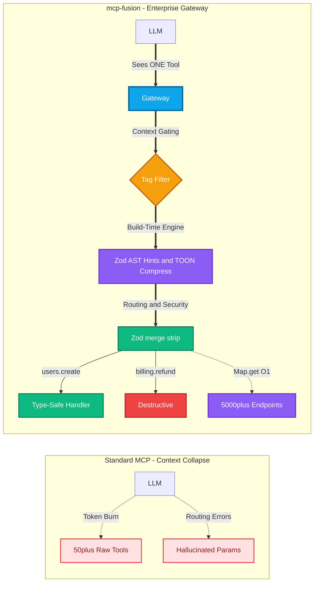

<div align="center">
  <h1>⚡️ mcp-fusion</h1>
  <p><b>The Enterprise Multiplexer for MCP. Route 5,000+ endpoints through a single LLM tool.</b></p>
  
  [](https://www.npmjs.com/package/@vinkius-core/mcp-fusion)
  [](https://www.typescriptlang.org/)
  [](https://modelcontextprotocol.io/)
  [](LICENSE)
</div>

<br/>

**[Read the Official Documentation & Guides on GitHub Pages](https://vinkius-labs.github.io/mcp-fusion/)**

<br/>

**Stop registering hundreds of individual Model Context Protocol (MCP) tools. Ship ONE.**

`mcp-fusion` is an advanced TypeScript framework that consolidates related MCP operations into a single tool behind a discriminator field. Built with a strict **domain model layer** for hierarchical entity management and a **build-time strategy engine** designed to scale to 5,000+ endpoints.

Fewer tools mean less context pressure on the LLM, zero routing hallucinations, and radically cleaner server code.

```bash
npm install @vinkius-core/mcp-fusion zod
```

---

## 🚨 The Architectural Bottleneck: Context Collapse

Standard MCP servers that expose individual tools for every CRUD operation (`create_project`, `update_project`, `delete_project`, `list_projects`) create two cascading system failures:

1. **Context Exhaustion:** Every tool definition burns expensive tokens in the LLM's context window. At 30+ tools, API costs explode and the model's memory degrades.
2. **Routing Confusion:** Semantically similar tools compete for selection. The LLM hallucinates parameters or picks `update_project` when it should pick `create_project`.

The workaround is writing fewer, bloated tools — or rotating tool sets per conversation. Both are brittle.

## ✅ The Solution: Build-Time Multiplexing & Context Gating

Group related operations under a single tool. The LLM sees ONE `platform` tool and selects the exact operation through an `action` enum. 

The framework handles description generation, schema composition, annotation aggregation, middleware compilation, strict validation, and error formatting — **all at build time**.



---

## 🤯 The "Aha!" Moment: What the LLM Actually Sees

Instead of flooding the LLM with 50 fragile JSON schemas, `mcp-fusion` uses **Zod AST introspection** to cross-reference every field across all actions. Five individual tools become one registered tool. 

The LLM simply sees this mathematically perfect, auto-generated prompt:

```text
Action: list | create | delete
- 'list': Requires: workspace_id. For: list
- 'create': Requires: workspace_id, name. For: create
- 'delete': Requires: workspace_id, project_id ⚠️ DESTRUCTIVE
```

*No guessing. No hallucinated parameters. Absolute routing precision.*

---

## 🚀 Quick Start

mcp-fusion offers **two APIs** — choose the one that fits your team:

### Option A: `defineTool()` — JSON-First (Zero Zod Required)

Perfect for rapid prototyping. No Zod imports needed — describe params with plain strings.

```typescript
import { defineTool, ToolRegistry, success, error } from '@vinkius-core/mcp-fusion';

const projects = defineTool<AppContext>('projects', {
    description: 'Manage workspace projects',
    shared: { workspace_id: 'string' },  // Injected into ALL actions
    actions: {
        list: {
            readOnly: true,
            params: { status: { enum: ['active', 'archived'] as const, optional: true } },
            handler: async (ctx, args) => success(await ctx.db.projects.findMany()),
        },
        create: {
            params: {
                name: { type: 'string', min: 1, max: 100 },
                email: { type: 'string', regex: '^[\\w-.]+@([\\w-]+\\.)+[\\w-]{2,4}$' },
            },
            handler: async (ctx, args) => success(await ctx.db.projects.create(args)),
        },
        delete: {
            destructive: true,
            params: { project_id: 'string' },
            handler: async (ctx, args) => {
                await ctx.db.projects.delete(args.project_id);
                return success('Project deleted');
            },
        },
    },
});

const registry = new ToolRegistry<AppContext>();
registry.register(projects);
registry.attachToServer(server, {
    contextFactory: (extra) => createAppContext(extra),
});
```

### Option B: `createTool()` — Full Zod Power Mode

For senior engineers who need custom `.regex()`, `.refine()`, `.transform()`, and advanced Zod.

```typescript
import { createTool, ToolRegistry, success } from '@vinkius-core/mcp-fusion';
import { z } from 'zod';

const projects = createTool<AppContext>('projects')
    .description('Manage projects')
    .commonSchema(z.object({
        workspace_id: z.string().describe('Workspace identifier'),
    }))
    .action({
        name: 'list',
        readOnly: true,
        schema: z.object({ status: z.enum(['active', 'archived']).optional() }),
        handler: async (ctx, args) => success(await ctx.db.projects.findMany()),
    })
    .action({
        name: 'delete',
        destructive: true,
        schema: z.object({ project_id: z.string() }),
        handler: async (ctx, args) => {
            await ctx.db.projects.delete({ where: { id: args.project_id } });
            return success('Project deleted');
        },
    });
```

**Both APIs produce identical MCP tool definitions. Mix and match freely in the same registry.**

→ [Read the full Getting Started Guide](docs/quickstart.md)

---

## 🏗️ Enterprise Engineering Core

This is not a simple utility wrapper. `mcp-fusion` is a high-performance routing engine built for massive scale, strict security boundaries, and zero-allocation runtime execution.

### Token Management at Scale — Tag-Based Selective Exposure
> **"5,000 endpoints — won't that blow up the token context?"** No. 

The framework uses a 3-layer Context Gating strategy to keep token usage strictly under control:
1. **Layer 1 — Grouping reduces tool count:** Instead of 5,000 individual tools, a `platform` tool with 50 actions is ONE tool definition in `tools/list`. The LLM sees 1 tool, not 50.
2. **Layer 2 — Tag filtering controls what the LLM sees:** You do NOT expose all tools at once. Each builder has `.tags()`, and `attachToServer()` accepts a `filter` with `tags` (include) and `exclude` options.
3. **Layer 3 — TOON compresses descriptions:** For tools that ARE exposed, metadata is compressed.

```typescript
// Register 5,000 endpoints across domain-specific grouped tools
const usersTool = new GroupedToolBuilder<AppContext>('users').tags('core').group(...);
const adminTool = new GroupedToolBuilder<AppContext>('admin').tags('admin', 'internal').group(...);

registry.registerAll(usersTool, adminTool);

// Conversation about user management? Expose only core tools:
registry.attachToServer(server, { filter: { tags: ['core'] } }); // LLM sees: 1 tool

// Full access, but never internal tools:
registry.attachToServer(server, { filter: { exclude: ['internal'] } });
```
*Tag filtering acts as a context gate — you control exactly what the LLM sees, per session.*

### Two-Layer Architecture
1. **Layer 1 — Domain Model:** A hierarchical entity model for MCP primitives (`Group`, `Tool`, `Prompt`, `Resource`, `PromptArgument`) with tree traversal, multi-parent leaves, fully-qualified names (dot-separated, configurable separator), metadata maps, icons, and bidirectional type converters. This is the structural backbone — think of it as the AST for your MCP server.
2. **Layer 2 — Build-Time Strategy Engine:** `GroupedToolBuilder` orchestrates six pure-function strategy modules to generate a single MCP tool definition. All heavy computation happens at build time. At runtime, `execute()` does a single `Map.get()` lookup and calls a pre-compiled function.

### Per-Field Annotation Intelligence (4-Tier System)
The `SchemaGenerator` analyzes every field across every action directly from Zod `isOptional()` introspection, cross-referencing them to produce 4 annotation tiers automatically:

| Tier | Condition | Generated Annotation | LLM Reads As |
|---|---|---|---|
| **Always Required** | Field is in `commonSchema` and required | `(always required)` | "I must always send this field" |
| **Required-For** | Required in every action that uses it | `Required for: create, update` | "I need this for specific actions" |
| **Required + Optional** | Required in some, optional in others | `Required for: create. For: update` | "Required for create, optional for update" |
| **For** | Optional in all actions that use it | `For: list, search` | "Only relevant for these actions" |

### Zod Parameter Stripping (Built-In Security Layer)
When the LLM sends arguments, `execute()` merges `commonSchema` + `action.schema` using Zod's `.merge().strip()`, then runs `safeParse()`. 
1. Unknown/injected fields are silently stripped.
2. Type coercion happens safely through Zod.
3. The handler receives exactly the shape it declared. 
**The LLM cannot inject parameters that your schema does not declare. This is a security boundary, not just validation.**

### Hierarchical Grouping for Large API Surfaces
For massive API surfaces, actions support `module.action` compound keys. **Flat mode** (`.action()`) and **hierarchical mode** (`.group()`) are mutually exclusive on the same builder.

```typescript
new GroupedToolBuilder<AppContext>('platform')
    .tags('core') 
    .group('users', 'User management', g => {
        g.use(requireAdmin)  // Group-scoped middleware
         .action({ name: 'list', readOnly: true, handler: listUsers })
         .action({ name: 'ban', destructive: true, schema: banSchema, handler: banUser });
    })
    .group('billing', 'Billing operations', g => {
        g.action({ name: 'refund', destructive: true, schema: refundSchema, handler: issueRefund });
    });
```
*The discriminator enum automatically becomes: `users.list | users.ban | billing.refund`.*

### Pre-Compiled Middleware Chains
Middleware follows the `next()` pattern. But unlike Express.js, chains are compiled at **build time**. The `MiddlewareCompiler` wraps handlers right-to-left into nested closures and stores the result. At runtime, `execute()` calls `this._compiledChain.get(action.key)`. 
**Zero chain assembly, zero closure allocation per request.** Supports both **Global** and **Group-scoped** execution.

### Context Derivation — `defineMiddleware()` (tRPC-style)
Middlewares that return data merge it into the context for downstream handlers. TypeScript infers the derived type automatically:
```typescript
import { defineMiddleware } from '@vinkius-core/mcp-fusion';

const requireAuth = defineMiddleware(async (ctx: { token: string }) => {
    const user = await db.getUser(ctx.token);
    if (!user) throw new Error('Unauthorized');
    return { user };  // ← TS infers: { user: User }
});

const billing = createTool<AppContext>('billing')
    .use(requireAuth.toMiddlewareFn())
    .action({
        name: 'refund',
        handler: async (ctx, args) => success(`Refunded by ${ctx.user.id}`),
    });
```

### Self-Healing Errors — `toolError()`
Structured error responses with recovery instructions for fully autonomous LLM agents:
```typescript
import { toolError } from '@vinkius-core/mcp-fusion';

return toolError('ProjectNotFound', {
    message: `Project '${id}' does not exist.`,
    suggestion: 'Call projects.list first to get valid IDs.',
    availableActions: ['projects.list'],
});
// Output: [ProjectNotFound] Project 'xyz' does not exist.
//         💡 Suggestion: Call projects.list first to get valid IDs.
//         📋 Try: projects.list
```

### Streaming Progress — `progress()` 
Generator handlers can yield progress events during long-running operations:
```typescript
import { progress, success } from '@vinkius-core/mcp-fusion';

handler: async function* (ctx, args) {
    yield progress(10, 'Cloning repository...');
    yield progress(50, 'Building AST...');
    yield progress(90, 'Almost done...');
    return success('Deployed successfully');
}
```

### Type-Safe Client — `createFusionClient()` (tRPC-style)
End-to-end type safety from server to client, with full autocomplete:
```typescript
import { createFusionClient } from '@vinkius-core/mcp-fusion/client';
import type { AppRouter } from './mcp-server';

const client = createFusionClient<AppRouter>(transport);
const result = await client.execute('projects.create', { name: 'Vinkius V2' });
//                                   ^^^^^^^^^^^^^^^^    ^^^^^^^^^^^^^^^^^
//                                   autocomplete!       typed args!
```

### Compile-Time DX — `ValidateConfig`
`defineTool()` uses type-level validation to produce readable, localized TypeScript errors instead of deep recursive type explosions:
```text
❌ Type Error: handler must return ToolResponse. Use return success(data) or return error(msg).
```

### TOON Token Optimization (Slash API Costs)
Descriptions and responses can be encoded in TOON (Token-Oriented Object Notation) via `@toon-format/toon` — a compact pipe-delimited format that eliminates repeated JSON keys:
```typescript
builder.toonDescription(); // Token-optimized prompts (saves tokens on tools/list)
return toonSuccess(users); // Slashes token cost on array responses back to LLM
```

### Type-Safe Common Schema Propagation
`commonSchema()` propagates types through generics. The return type narrows from `GroupedToolBuilder<TContext, Record<string, never>>` to `GroupedToolBuilder<TContext, TSchema["_output"]>`. Every subsequent handler receives `TSchema["_output"] & TCommon` — checked at compile time, not runtime. No `as any`, no type assertions needed.

### Duck-Typed Server Resolution
`attachToServer()` accepts `unknown` and performs runtime duck-type detection:
1. Has `.server.setRequestHandler`? → `McpServer` (high-level SDK).
2. Has `.setRequestHandler` directly? → `Server` (low-level SDK).
**Zero peer dependency coupling to MCP server internals.** If the SDK restructures its exports, this framework does not break. Returns a `DetachFn` for clean teardown testing.

### Conservative Annotation Aggregation
MCP tool annotations operate at the tool level, but actions have individual behavioral properties. The framework resolves this safely:
- `destructiveHint: true` if **any** action is destructive (worst case assumption).
- `readOnlyHint: true` only if **all** actions are read-only.
- `idempotentHint: true` only if **all** actions are idempotent.
*(Also supports `openWorldHint` and `returnDirect` via manual overrides).*

### ⚠️ DESTRUCTIVE Warnings & Error Handling
* **Safety Signal:** When an action is marked `destructive: true`, the `DescriptionGenerator` appends a literal `⚠️ DESTRUCTIVE` warning. LLMs trained on safety data recognize this and request user confirmation.
* **Error Isolation:** Every error includes the `[toolName/action]` prefix for instant LLM self-correction (e.g., `Error: action is required. Available: list, create, delete`).

### Freeze-After-Build Immutability
Once `buildToolDefinition()` is called, the builder is permanently frozen. The `_actions` array is sealed with `Object.freeze()`. All mutation methods throw. This eliminates an entire class of bugs where tools are accidentally mutated after registration — adopting the same pattern Protocol Buffers uses.

### Introspection API
Need programmatic documentation, compliance audits, or dashboard generation?
```typescript
const meta = builder.getActionMetadata();
// Returns: [{ key, actionName, groupName, description, destructive, readOnly, requiredFields, hasMiddleware }]
```

---

## 🔬 Architecture & Internals

### Project Structure

The codebase is organized into bounded contexts with shallow nesting (max 2 levels):

```
src/
├── domain/          → Pure immutable domain models
├── converters/      → Domain-to-DTO converters
├── framework/
│   ├── types.ts     → ALL contracts & shared types (single file)
│   ├── result.ts    → Result<T> monad (cross-cutting)
│   ├── response.ts  → Response helpers (cross-cutting)
│   ├── builder/     → GroupedToolBuilder, ActionGroupBuilder, Compiler
│   ├── execution/   → ExecutionPipeline, MiddlewareCompiler
│   ├── schema/      → Schema, Description, Annotation strategies
│   ├── registry/    → ToolRegistry, ToolFilterEngine
│   └── server/      → ServerResolver, ServerAttachment
└── index.ts         → Public API barrel
```

### Domain Model Layer (`src/domain/`)
The package provides a full domain model for MCP primitives:

| Class | Purpose |
|---|---|
| `Group` | Tree node with parent/child relationships, configurable name separator, recursive FQN |
| `Tool` | Leaf node with input/output schemas and `ToolAnnotations` |
| `Prompt` | Leaf node with `PromptArgument` list |
| `Resource` | Leaf node with URI, size, mimeType, and `Annotations` (audience, priority) |
| `BaseModel` | Name, title, description, meta, icons |
| `GroupItem` | Multi-parent group support, root traversal |

*Features Bidirectional converters (`ToolConverterBase`, `GroupConverterBase`, etc.) with null filtering for clean conversion to external representations.*

### Strategy Modules
Six pure-function modules organized by bounded context. Every module is independently testable and replaceable. **Zero shared state.**

| Context | Module | Responsibility |
|---|---|---|
| `schema/` | `SchemaGenerator` | 4-tier per-field annotations from Zod schemas |
| `schema/` | `DescriptionGenerator` | 3-layer descriptions with ⚠️ DESTRUCTIVE warnings |
| `schema/` | `ToonDescriptionGenerator` | TOON-encoded descriptions via `@toon-format/toon` |
| `schema/` | `AnnotationAggregator` | Conservative behavioral hint aggregation |
| `execution/` | `MiddlewareCompiler` | Right-to-left closure composition at build time |
| `schema/` | `SchemaUtils` | Zod field extraction + build-time schema collision detection |

---

## 🛠️ Key Capabilities Matrix

| Capability | What It Solves |
|---|---|
| **`defineTool()` — JSON-First API** | Build tools without Zod imports — strings, enums, arrays, regex |
| **`createTool()` — Zod Power Mode** | Full `.refine()`, `.transform()`, `.regex()` for advanced validation |
| **`createFusionClient()` — Typed Client** | tRPC-style end-to-end type safety from server to client |
| **`defineMiddleware()` — Context Derivation** | tRPC-style derive data into context with type inference |
| **`toolError()` — Self-Healing Errors** | Structured error recovery for autonomous LLM agents |
| **`progress()` — Streaming Progress** | Generator handlers yield progress during long operations |
| **`ValidateConfig` — Compile-Time DX** | Readable TypeScript errors instead of recursive type explosions |
| **Action Consolidation** | Reduces tool count, improves LLM routing accuracy |
| **Hierarchical Groups** | Namespace 5,000+ actions with `module.action` compound keys |
| **4-Tier Field Annotations** | LLM knows exactly which fields to send per action |
| **Zod `.merge().strip()`** | Type-safe schema composition + unknown field stripping |
| **Common Schema Propagation** | Shared fields with compile-time generic inference |
| **Pre-Compiled Middleware** | Auth, rate limiting, audit — zero runtime chain assembly |
| **Group-Scoped Middleware** | Different middleware per namespace (e.g., admin-only for users) |
| **TOON Encoding** | Token reduction on descriptions and responses |
| **Conservative Annotations** | Safe MCP behavioral hints from per-action properties |
| **⚠️ DESTRUCTIVE Warnings** | Safety signal in LLM tool descriptions |
| **Tag Filtering** | Include/exclude tags for selective tool exposure |
| **Introspection API** | Runtime metadata for compliance, dashboards, audit trails |
| **Freeze-After-Build** | `Object.freeze()` prevents mutation bugs after registration |
| **Error Isolation** | `[tool/action]` prefixed errors for instant debugging |
| **Duck-Typed Server** | Works with `Server` and `McpServer` — zero import coupling |
| **Detach Function** | Clean teardown for testing via `DetachFn` |
| **Domain Model** | Hierarchical tree with multi-parent, FQN, converters |
| **Auto-Build on Execute** | `execute()` triggers `buildToolDefinition()` if not called |
| **Schema Collision Detection** | Build-time error when field types conflict across actions |

---

## 📚 Official Guides

Ready to build production agents? Dive into the documentation:

| Guide | What You Will Learn |
|---|---|
| 🏁 **[Getting Started](docs/quickstart.md)** | First tool, context, common schema, groups, TOON — complete examples. |
| 🏗️ **[Architecture](docs/architecture.md)** | Domain model mapping, Strategy pattern, build-time engine, execution flow. |
| 📈 **[Scaling Guide](docs/scaling.md)** | How tag filtering, TOON, and unification prevent hallucination at 5,000+ endpoints. |
| 🛡️ **[Middleware](docs/middleware.md)** | Global, group-scoped, pre-compilation, context derivation, real patterns. |
| 🔍 **[Introspection](docs/introspection.md)** | Runtime metadata extraction for Enterprise compliance. |
| 📖 **[API Reference](docs/api-reference.md)** | Comprehensive typings, methods, and class structures. |

---

## Requirements

- Node.js 18+
- TypeScript 5.7+
- `@modelcontextprotocol/sdk ^1.12.1` (peer dependency)
- `zod ^3.25.1 || ^4.0.0` (peer dependency)
- `@toon-format/toon` (for TOON features)
